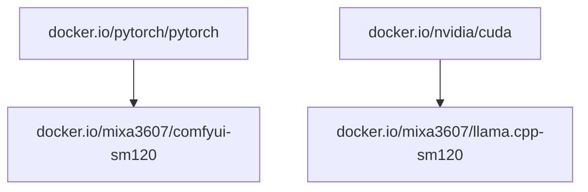

# ML software for SM120 arch

## Subprojects

| Name      | About               | Artefacts | Status                                                                                                                                                | Docs                            |
| --------- | ------------------- | --------- | ----------------------------------------------------------------------------------------------------------------------------------------------------- | ------------------------------- |
| llama.cpp | llama.cpp images    | image     |  | [readme](./llama.cpp/README.md) |
| ComfyUI   | ComfyUI images      | image     |   | [readme](./comfyui/README.md)   |

## Prebuilt images

| Project   | Image                                                                                                                             |
| --------- | --------------------------------------------------------------------------------------------------------------------------------- |
| llama.cpp | [`docker.io/mixa3607/llama.cpp-sm120:<ver>-cuda-13.3.0-cudnn`](https://hub.docker.com/r/mixa3607/llama.cpp-sm120/tags)\* |
| ComfyUI   | [`docker.io/mixa3607/comfyui-sm120:<ver>-cuda-13.2-cudnn9`](https://hub.docker.com/r/mixa3607/comfyui-sm120/tags)\*      |

> \* llama.cpp and ComfyUI have daily builds. See last tag on dockerhub

## Deps graph

