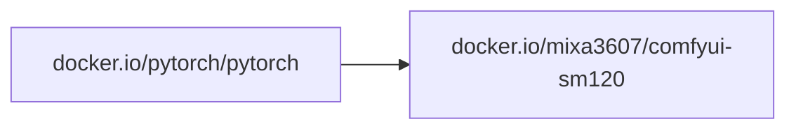

# ComfyUI SM120

The most powerful and modular diffusion model GUI, API and backend with a
graph/nodes interface. https://github.com/Comfy-Org/ComfyUI

All images are built for the `sm120` (NVIDIA Blackwell) GPU architecture.

## Dependencies

The image is built on top of the official [PyTorch image](https://hub.docker.com/r/pytorch/pytorch):



`ComfyUI` is cloned from the upstream repo at build time (pinned to a git tag),
so the PyTorch/CUDA versions are fixed per image tag.

## Prebuilt images

- [`docker.io/mixa3607/comfyui-sm120:<ver>-cuda-13.2-cudnn9`](https://hub.docker.com/r/mixa3607/comfyui-sm120/tags?name=cuda-13.2)\*

> \* have daily builds. See last tag on Docker Hub.

## Run

### Docker

The image needs NVIDIA GPU access. Example:

```bash
docker run --rm \
  --gpus all \
  -p 8188:8188 \
  -e PERSISTENCE_PATH=/data \
  -v $(pwd)/data:/data \
  docker.io/mixa3607/comfyui-sm120:<ver>-cuda-13.2-cudnn9
```

Environment variables:

| Variable           | Description                                                                 |
| ------------------ | --------------------------------------------------------------------------- |
| `PERSISTENCE_PATH` | Copy `models`, `custom_nodes`, `input`, `output` there; use it as `--base-directory` and store the SQLite DB |
| `VENV_NAME`        | Create/activate a virtual environment (with `--system-site-packages`) at `/data/<venv>` (with persistence) or `/comfyui/<venv>` |
| `BOOTSTRAP_ONLY`   | Set to `1` to only prepare persistence/venv and exit without starting ComfyUI |

Behavior:

- Always runs with `--enable-manager`
- With `PERSISTENCE_PATH` set, data and the SQLite database
  (`sqlite:///<PERSISTENCE_PATH>/database/comfyui.db`) are persisted to the
  mounted volume
- Additional CLI args can be appended to the `docker run` command

Also see https://github.com/hartmark/sd-rocm/blob/main/docker-compose.yml

### Kubernetes

Helm chart and samples: [mixa3607 charts](https://github.com/mixa3607/charts)

## Build from source

The build happens inside `docker buildx` on top of the official PyTorch base
image (`docker.io/pytorch/pytorch:<torch>-cuda<cuda>-runtime`) and produces
the ComfyUI image.

| Artifact | Script                      | Dockerfile               |
| -------- | --------------------------- | ------------------------ |
| Image    | `./build-and-push.image.sh` | `./build-image.Dockerfile` |

### Prerequisites

- Docker with the `buildx` plugin
- Access to the PyTorch base image

### Presets

Preset files set the ComfyUI, PyTorch and CUDA versions. Source one, then run
the build script:

```bash
. preset.v0.33.1-cuda-13.2-cudnn9.sh
./build-and-push.image.sh
```

To update the preset to the latest ComfyUI release, run `./upd2last-release.sh`.

### Build variables

Defaults come from [`env.sh`](./env.sh) and [`../env.sh`](../env.sh). Export
any variable to override it.

| Variable                  | Default                               | Description                                  |
| ------------------------- | ------------------------------------- | -------------------------------------------- |
| `COMFYUI_IMAGE`           | `docker.io/mixa3607/comfyui-sm120`    | Destination image name                       |
| `COMFYUI_TORCH_IMAGE`     | `docker.io/pytorch/pytorch`           | PyTorch base image name                      |
| `COMFYUI_CUDA_VERSION`    | `13.2-cudnn9`                         | CUDA version of the base image               |
| `COMFYUI_PYTORCH_VERSION` | `2.13.0`                              | PyTorch version of the base image            |
| `COMFYUI_REPO`            | `https://github.com/Comfy-Org/ComfyUI.git` | ComfyUI git repository                |
| `COMFYUI_BRANCH`          | `master`                              | ComfyUI git tag/branch to build              |
| `COMFYUI_COMMIT`          | *(empty)*                             | Pin a specific commit (on top of the branch) |
| `COMFYUI_PUSH`            | `1`                                   | Push the image to the registry               |
| `COMFYUI_FORCE_BUILD`     | *(unset)*                             | Set to `1` to rebuild even if the tag exists |
| `REPO_GIT_REF`            | *(git tag, else short SHA)*           | Build revision appended to the tag           |

The base image is resolved as
`$COMFYUI_TORCH_IMAGE:$COMFYUI_PYTORCH_VERSION-cuda$COMFYUI_CUDA_VERSION-runtime`
(e.g. `docker.io/pytorch/pytorch:2.13.0-cuda13.2-cudnn9-runtime`).

### Build the image

```bash
. preset.v0.33.1-cuda-13.2-cudnn9.sh
./build-and-push.image.sh
```

Five tags are created:

- `$COMFYUI_IMAGE:$BRANCH-torch-$PYTORCH_VERSION-cuda-$CUDA_VERSION-$REPO_GIT_REF` — pinned to the build revision
- `$COMFYUI_IMAGE:$BRANCH-torch-$PYTORCH_VERSION-cuda-$CUDA_VERSION`
- `$COMFYUI_IMAGE:$BRANCH-cuda-$CUDA_VERSION-$REPO_GIT_REF` — pinned to the build revision
- `$COMFYUI_IMAGE:$BRANCH-cuda-$CUDA_VERSION`
- `$COMFYUI_IMAGE:latest-cuda-$CUDA_VERSION`

The build is skipped if the pinned tag is already in the registry, unless
`COMFYUI_FORCE_BUILD=1`.

The build log is saved to `./logs/build_<timestamp>.log`.

### Push

Set `COMFYUI_PUSH=0` to keep the image local (no `--push` passed to buildx).

### Custom registry / local overrides

Example:

```bash
export COMFYUI_CUDA_VERSION=13.2-cudnn9
export COMFYUI_PYTORCH_VERSION=2.13.0
export COMFYUI_BRANCH=v0.33.1
export COMFYUI_IMAGE=registry.example.com/apps/comfyui-sm120
export COMFYUI_TORCH_IMAGE=registry.example.com/apps/pytorch-sm120
./build-and-push.image.sh
```

See [`../.env-local.sh`](../.env-local.sh) for a ready-made local override file.
