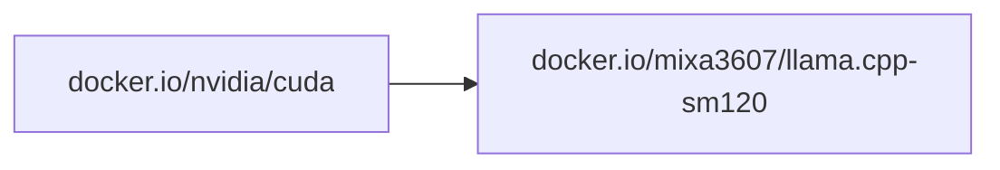

# llama.cpp SM120

LLM inference in C/C++. https://github.com/ggml-org/llama.cpp

All images are built for the `sm120` (NVIDIA Blackwell) GPU architecture.

## Dependencies

The image is built on top of the official NVIDIA CUDA image:



`llama.cpp` is cloned from the upstream repo at build time (pinned to a git tag), so the CUDA version is fixed per image tag.

## Prebuilt images

- [`docker.io/mixa3607/llama.cpp-sm120:<ver>-cuda-13.3.0-cudnn`](https://hub.docker.com/r/mixa3607/llama.cpp-sm120/tags?name=cuda-13.3.0)\*

> \* have daily builds. See last tag on Docker Hub.

## Build from source

The build happens inside `docker buildx` on top of the NVIDIA CUDA base image
(`docker.io/nvidia/cuda:<cuda>-devel-ubuntu24.04`) and produces the llama.cpp image.

| Artifact | Script                      | Dockerfile                 |
| -------- | --------------------------- | -------------------------- |
| Image    | `./build-and-push.image.sh` | `./build-image.Dockerfile` |

### Prerequisites

- Docker with the `buildx` plugin
- Access to the NVIDIA CUDA base image

### Presets

Preset files set the llama.cpp, CUDA and other versions. Source one, then run the build script:

```bash
. preset.b10612-cuda-13.3.0-cudnn.sh
./build-and-push.image.sh
```

To update the presets to the latest llama.cpp release, run `./upd2last-release.sh`.

### Build variables

Defaults come from [`env.sh`](./env.sh) and [`../env.sh`](../env.sh). Export any variable to override it.

| Variable             | Default                                | Description                                    |
| -------------------- | -------------------------------------- | ---------------------------------------------- |
| `LLAMA_IMAGE`        | `docker.io/mixa3607/llama.cpp-sm120`   | Destination image name                         |
| `LLAMA_CUDA_VERSION` | `13.3.0-cudnn`                         | CUDA version of the base image                 |
| `LLAMA_CUDA_IMAGE`   | `docker.io/nvidia/cuda`                | CUDA base image name                           |
| `LLAMA_CUDA_ARCH`    | `120`                                  | Target GPU architecture (`CMAKE_CUDA_ARCHITECTURES`) |
| `LLAMA_REPO`         | `https://github.com/ggml-org/llama.cpp.git` | llama.cpp git repository                |
| `LLAMA_BRANCH`       | `master`                               | llama.cpp git tag/branch to build              |
| `LLAMA_COMMIT`       | _(empty)_                              | Pin a specific commit (on top of the branch)   |
| `LLAMA_CCACHE_MAXSIZE` | `2G`                                 | ccache size limit; ccache is mounted across builds |
| `LLAMA_IS_RELEASE`   | `0`                                    | `1` — full tags; otherwise `-pre` tag only     |
| `LLAMA_PUSH`         | `1`                                    | Push the image to the registry                 |
| `LLAMA_FORCE_BUILD`  | _(unset)_                              | Set to `1` to rebuild even if the tag exists   |
| `REPO_GIT_REF`       | _(git tag, else short SHA)_            | Build revision appended to the tag             |

The base image is resolved as
`$LLAMA_CUDA_IMAGE:$LLAMA_CUDA_VERSION-devel-ubuntu24.04` (e.g. `docker.io/nvidia/cuda:13.3.0-cudnn-devel-ubuntu24.04`).

The build uses `ccache` (max size `LLAMA_CCACHE_MAXSIZE`, default 2G) mounted
via a BuildKit cache so rebuilds reuse compiled objects.

### Build the image

```bash
. preset.b10612-cuda-13.3.0-cudnn.sh
./build-and-push.image.sh
```

With `LLAMA_IS_RELEASE=1` two tags are created:

- `$LLAMA_IMAGE:$LLAMA_PRESET_NAME-$REPO_GIT_REF` — pinned to the build revision
- `$LLAMA_IMAGE:$LLAMA_PRESET_NAME` — floating tag

Otherwise (`LLAMA_IS_RELEASE=0`, default) only one pre-release tag is created:

- `$LLAMA_IMAGE:$LLAMA_PRESET_NAME-$REPO_GIT_REF-pre`

The build is skipped if the pinned tag is already in the registry, unless `LLAMA_FORCE_BUILD=1`.

The build log is saved to `./logs/build_<timestamp>.log`.

### Push

Set `LLAMA_PUSH=0` to keep the image local (no `--push` passed to buildx).

### Custom registry / local overrides

Example:

```bash
export LLAMA_CUDA_VERSION=13.3.0-cudnn
export LLAMA_BRANCH=b10612
export LLAMA_IMAGE=registry.example.com/apps/llama.cpp-sm120
export LLAMA_CUDA_IMAGE=registry.example.com/apps/cuda
./build-and-push.image.sh
```

See [`../.env-local.sh`](../.env-local.sh) for a ready-made local override file.
